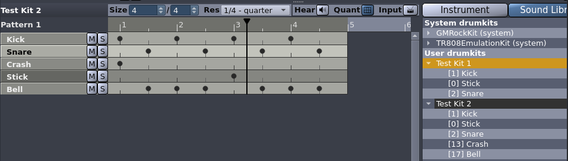
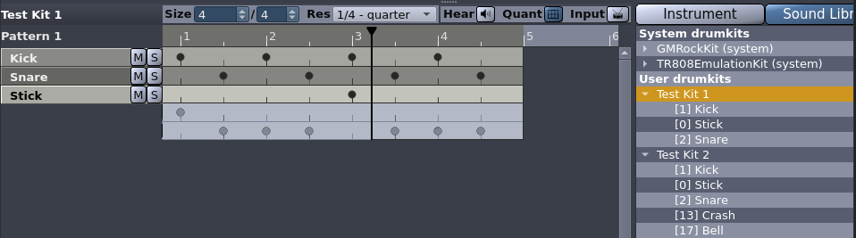
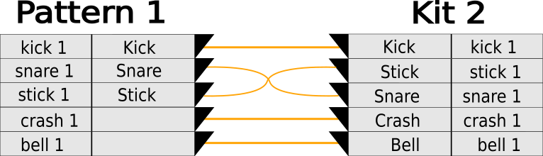
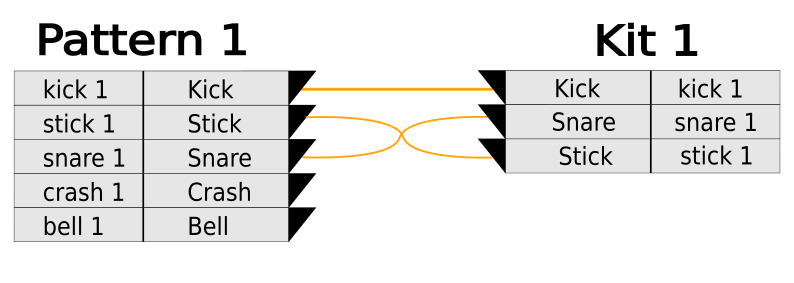

# Proposal: Drumkit-independent patterns V2

Some time has past since the [first draft](0001-drumkit-independent-patterns.md)
of this proposal. A number of parts have already been implemented. But after
rethinking the whole concept I came up with a slightly different and more simple
approach.

## Goal

Patterns should be independent of the drumkit they were created with. This would
increase their reusability a lot and would also allow for large web-based
pattern collections.

I would implement this feature by mapping each instrument (contained in drumkits
and linked to notes within patterns) to an **instrument type** (called GID in
the previous draft). When loading a song, importing a pattern, or switching a
drumkit all notes involved are mapped to the (new) instruments holding the same
type.

## Storage

The mapping between instrument and instrument type is 1 : 1 and can be stored in
both `.h2drumkit` and `.h2pattern` file without breaking their current
structure. Instrument types of drumkits can already be edited using their
"Properties" dialog. Instrument types of notes in patterns are defined
implicitly by the drumkit used while programming them.

What's a bit tricky is to get an initial seed of types without either the need
to update all kits we host on SourceForge or requiring the user to discard all
local kits and download them anew.

For this we ship the `.h2map` files similar to the ones I proposed in the
[previous draft](0001-drumkit-independent-patterns.md). But here they will be
XML files including the 1 : 1 mapping between the instrument id and type used in
a kit. We ship them for all kits we host on SourceForge and they will be install
in the system data folder. Using those all downloaded kits and patterns created
using them will be filled with instrument types in case none are present in the
`drumkit.xml` or `.h2pattern` file. Other than that `.h2map` won't be used and
the general user / drumkit creator does not even has to know they exist.

(`.h2song` files in the upcoming versions of Hydrogen are just collections of
proper drumkit and patterns. No need to treat it separately.)

In case a drumkit is loaded with no instrument types assigned or a pattern
created using an unknown kit is imported, note to instrument mapping will be
handle the same as it is now: based on the instrument ID/position.

## Instrument types

The particular strings we use as instrument types are not formally defined in
this design. This makes it easy to support arbitrary kits, allows for easy
customization, but probably will also result in some mismatches.

The shipped `.h2map` files will contain a bunch of well-matched types and
Hydrogen does offer them as possible choices in the GUI. However, the user will
also be able to set them to arbitrary strings.

This way we are not the single source of truth and a third party would be easy
able to provide a separate only repo with alternative mappings. (All power to
the people!)

## UX

Our current UX will break in two significant ways:

1. There won't be an option "Keep instruments" when switching kits anymore.
   
   When loading a drumkit one get's this very drumkit regardless of the kit or
   pattern used before.
   
2. Not all lines of a pattern have to correspond to an instrument of the current
   drumkit.

   Cycling through different drumkits must be done without any loss of
   information.
   
   To underline this change, I (slightly) redesign the Instrument Editor and
   Pattern Editor in such a way Instrument Editor and the instrument list of the
   Pattern Editor become an unit and the actual Drum Pattern Editor / Piano Roll
   becomes a separate entity.

To ease some inconvenience that might arise due to 2., there will be a dialog
called `PatchBay` to remap all notes of one or more pattern to different
instruments as well as to allow for duplication and merging.

### Switching kits or loading patterns

Imagine we have **Pattern 1** programmed with **Kit 2** holding 5 instruments.

When loading drumkit **Kit 1** with only three instruments - having types also
contained in **Kit 2** - only three lines of the Pattern are now used (Their
order does not matter anymore!).

The two remaining ones are accessible (for copy/paste) but won't be played back.
One can assign an instrument to them by adding a new one using right clicking in
the same line of the instrument list or by duplicating an existing one using
<kbd>Ctrl</kbd> + drag.

Prior switching the `PatchBay` will look like this. (This can also be used for
kits holding no instrument types at all).

After switching the `PatchBay` will look like this.

When switching back to **Kit 2** we get the exact same state we started from.

https://github.com/hydrogen-music/hydrogen/discussions/1984

---

Update 2025-10-08:

Since the overhaul of the sidebar (instrument list) it is quite easy to change
the instrument types of the whole drumkit. I will drop the `PatchBay`.
